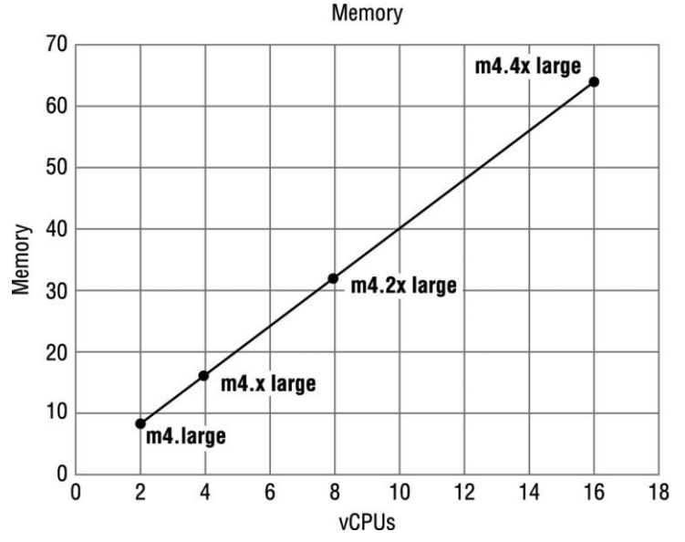
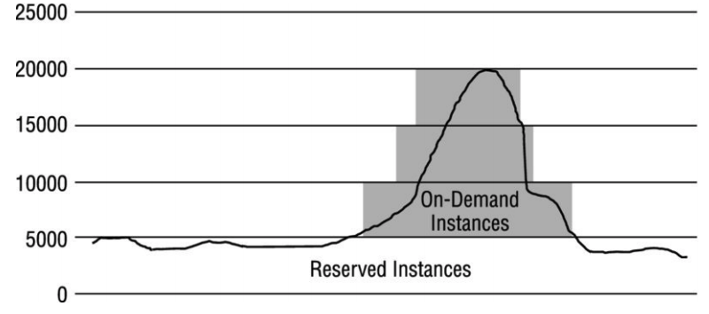

# EC2 & EBS

## EC2

### Compute Basics

* Computational power required to fulfill your workload
* EC2 launch virtual servers called _instances_
* 2 concepts:
  * the amount of virtual hardware
  * the software loaded on the instance

### Instance Types

* Dimensions:
  * Virtual CPUs\(vCPU\)
  * Memory
  * Storage
  * Network performance

| Family | Short for | Use cases |
| ---: | :--- | :--- |
| D | **D**ensity - Dense Storage |  |
| R | **R**AM - Memory Optimized | for memory-intensive workloads |
| M | **M**ain choice - General Purpose |  |
| C | **C**ompute - Compute Optimized  | for workloads requiring significant processing |
| G | **G**raphics - Graphic Intensive | intended for graphics and general-purpose GPU compute workloads |
| I | **I**OPS - Highspeed Strorage | for workloads requiring high amounts of fast SSD storage |
| F | **F**PGA - Field Programmable Gate Array |  |
| T | cheap general purpose \(**t2** micro\) |  |
| P | Graphic/ General Purpose GPU \(**P**ics\) |  |
| X | Memory Optimized |  |

### Amazon Machine Image \(AMIs\)

* Defines the initial software that will be on instance when it is launched
* Includes
  * The Operating System \(OS\)
  * The initial state of any patches
  * Application or system software
* 4 sources
  * Published by AWS 
    * default OS settings
  * The AWS Marketplace 
    * not need to install the software and the license agreement
    * cost: standard hourly cost for the instance, additional per-hour charge for additional softwares
  * Generated from existing instance
    * generated from the configured instance
  * Uploaded Virtual Servers 
    * various virtualization formats: raw, VHD, VMDK, OVA
* AMIs storage for the Root device \(Root Device Volume\)
  * Instance Store \(EPHEMERAL STORAGE\)
    * Can not stop the instance.
    * If the instance failed, basically you lost the instance.
    * The root device for an instance launched from the AMI is an instance store volume created from a template store in Amazon S3.
  * EBS Backed Volumes
    * The root device for an instance launched from the AMI is an Amazon EBS volume created from an EBS snapshot.
    * Can stop the instance. Load Balancer & Health checks

### Securely Using an Instance

#### Addressing an Instance

* Public Domain Name System \(DNS\) Name
  * Generated automatically, cannot be specified
  * Persists only while the instance is running
  * Cannot be transferred
* Public IP
  * Assigned form the addresses reserved, cannot be specified
  * Persist only while the instance is running
  * Cannot be transferred
* Elastic IP
  * Persist while the customer releases it 
  * Can be transferred

#### Initial Access

* EC2 using public-key cryptography called _key pair_ 
* Stored in _**~/.ssh/authorized\_keys**_ on the instance
* **Best practice:** change the initial local administration password 

#### Virtual Firewall Protection

* Called **Security Group**

| **Type of Security Group** | Capabilities |
| :--- | :--- |
| EC2-Classic Security Group | control outgoing instance traffic |
| VPC Security Group | control outgoing and incoming instance traffic |

* EC2 must have at least one and can have multiple Security Group

| Attribute | Meaning |
| :--- | :--- |
| Port | The port affected by this rule |
| Protocol | The communications standard for the traffic affected by this rule |
| Source/Destination | The other end of the communication, can be either of CIDR block or Security group |

* By default
  * All inbound traffic is blocked 
  * All outbound traffic is allowed
* Security group are **stateful firewall** → if you create an inbound rule allowing traffic in, that traffic is automatically allowed back out again.
* Cannot block specific IP addresses using Security Groups, instead use Network Access Control Lists
* Can specify allow rules, but not deny rules

### The Lifecycle of Instances

#### Launching

* Bootstraping
  * Configure instances and install applications programmatically
  * Examples

    * Applying patches and updates to the OS
    * Enrolling in a directory service
    * Installing application software

    ...

  * UserData is stored with the instance and is not encrypted → not to include any secrets such as password or keys in UserData
* VM Import/Export 
  * Can only export previously imported instances. 
  * Instances launched within AWS from AMIs cannot be exported
* Instance Metadata
  * Call to _http://169.254.169.254/lastest/meta-data_
  * Including
    * Associated security group
    * Instance ID
    * Instance type
    * AMI used to launch the instance

#### Managing instances

* Up to 10 tags per instance

| key | value |
| :--- | :--- |
| Project | TimeEntry |
| Environment | Production |
| BillingCode | 4004 |

#### Monitoring Instances

* Cloud watch
  * Standard Monitoring = 5 minutes
  * Detailed Monitoring = 1 minutes
  * Dashboard - Create dashboard to see what is happening with your AWS environment
  * Alarms - set Alarms that notify you when particular threshold are hit
  * Events - CloudWatch Events helps you to respond to state changes in your AWS resources.
  * Logs - helps you aggregate, monitor, and store logs.
  * Cloud watch - logging, monitoring of a resources. Cloud Trail monitoring all AWS services.

#### Modifying Instance 

* Instance Type
  * Can be changed to a different size
  * Stop and restart the instance to change
* Security Groups
  * Can change which security groups are associated with
  * EC2-Classic \(out of AWS VPC\) cannot be changed

#### Termination Protection

* Termination Protection is off by default
* Terminate the instance will fail until termination protection is disabled
* Does not prevent termination by OS _**shutdown**_ command

### Options

#### Pricing Options

* **On-Demand Instances**
  * The least cost effective
  * Provisions a variable level of compute
* **Reserved Instances**
  * Capacity reservations for predictable workloads
  * Save up to 75% over the on-demand options
  * Term commitment can be either 1 or 3 years
  * Logger the term, bigger the discount
  * Terms can be changed
    * AZ within a region
    * EC2-VPS → EC2-Classic
    * Instance type \(Linux only\)
*  **Spot Instances** 
  * Customers can bid price
  * For workloads that
    * Not time critical
    * Tolerant of interruption
  * Offer greatest discount
  * Terminate 
    * Customer terminates the instances
    * Spot price goes over the customer bid
    * Not enough unused capacity to meet the demand 
  * 2 minutes warning before termination
  * Use cases 
    * Analytics
    * Financial modeling
    * Big data
    * Media encoding
    * Scientific computing
    * Testing

#### Tenancy Options

* Shared Tenancy
  * default tenancy 
  * single host may house instances from different customers
* Dedicated Instances
  * hardware that's dedicated to a single customer
  * other instances \(not designated as dedicated\) of the account will run on shared tenancy
* Dedicated Host
  * Physical server for a single customer's use
  * Best for licensing requirements
  * Can bought with on-demand pricing option \(hourly\)
  * 70% discount with reservation beforehand

**Placement groups**

* Logical grouping of instances within a single Az
* Low network latency, high network throughput
* Choose instance type supports **enhanced networking** and **10 Gbps network performance**

#### Instance Stores

* Ephemeral Storage provides temporary block-level storage
* Temporary storage of information that changes frequently: buffers, caches, scratch data,...
* Very cost-effective solution
* Do not rely on if the data is valuable or long-term used

## EBS

* Used for workloads requires durable block storage

### Elastic Block Store Basics

#### Types of Amazon EBS Volumes

* 

